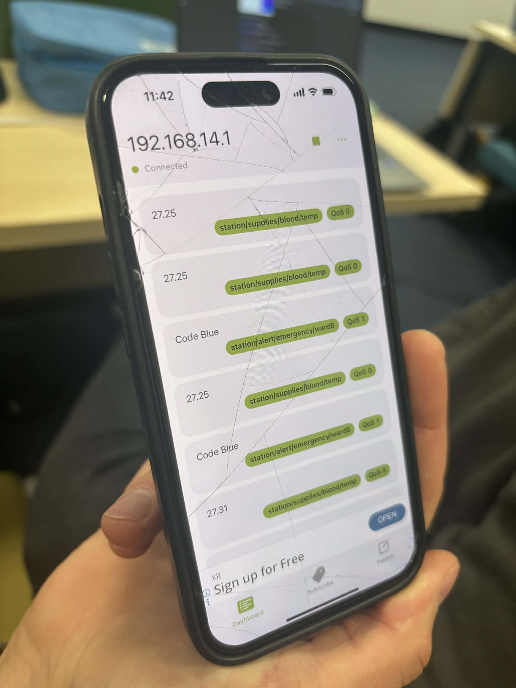
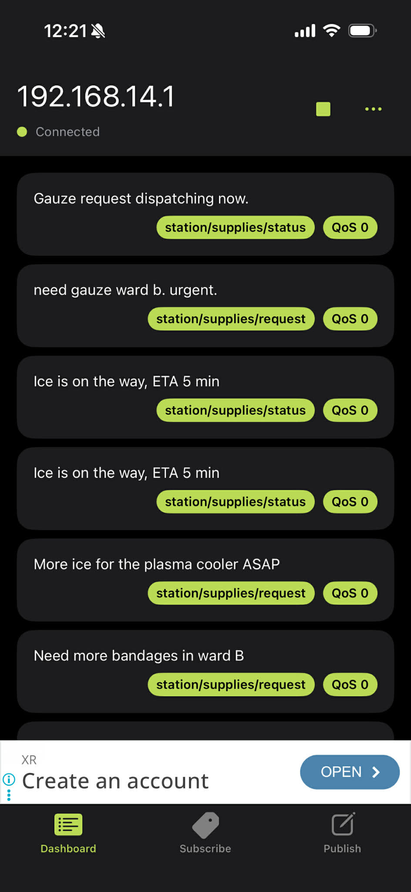
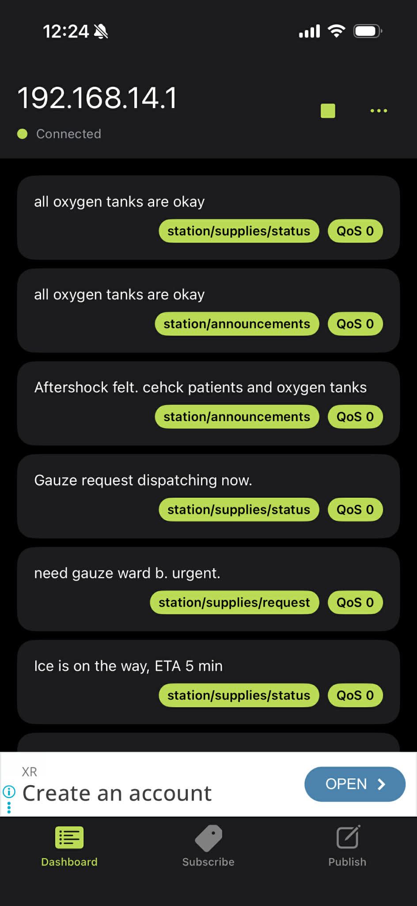
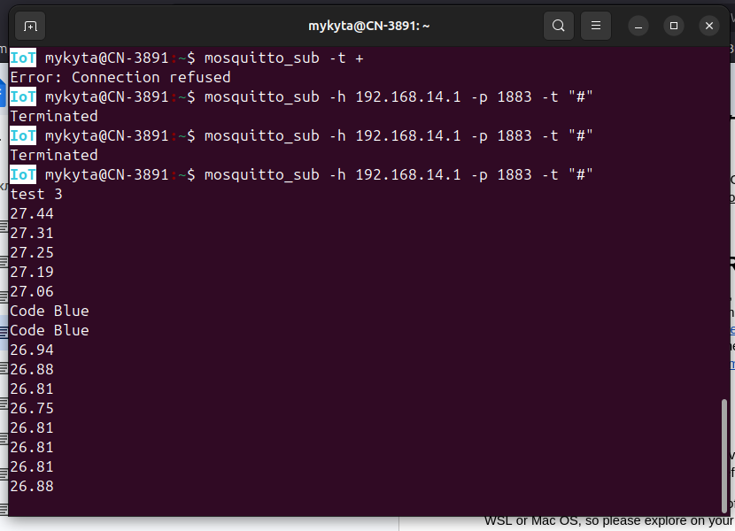
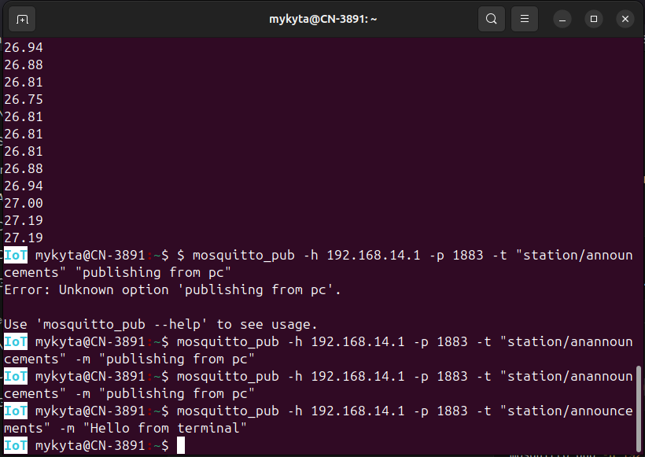
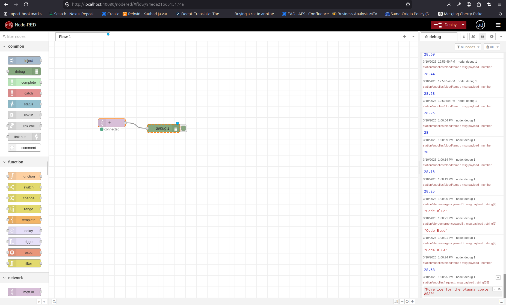
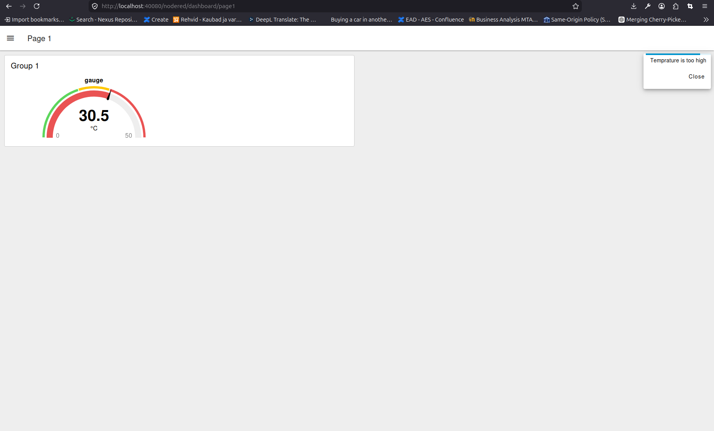

# Pictures for Module 3

## Week 1: Phase 1 - Phase 4

One person in our team done all of it with the person from other team. His name is Tim. Unfortunately, he made screenshots of all the staff. We don't know his Github link, but discord nickname is Shpetim_04874.

## Week 4

### Button and temprature sensor are working

The best proof that all was working is this video. You can see that when the guy pressing the button Code Blue message was sent every time. Also, temprature sensor sent new values all the time.

### Scene 1 and Scene 2

### Scene 3

### Scene 4

### MQTT ON NODE-RED

